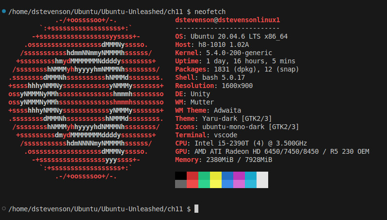

# Ubuntu Unleashed, 2019 Edition

## Chapter 11: Command-Line Master Class, Part 1

### Why Use the Command Line?

* You want to chain together two or more commands.
* You want to use a command or parameter available only on the shell.
* You are working on a text-only system.
* You have used it for along time and feel comfortable there.
* You want to automate a task.

### Using Basic commands

* cat - Prints the contents of a file
* cd - changes directories
* chmod - Changes file access permissions
* cp - Copies files
* du - Prints disk usage
* emacs - Edits text files
* find - Finds files by searching
* grep - Searches for a string in input
* less - Filters for paging through output
* ln - Creates links between files
* locate - Finds files from an index
* ls - Lists files iin the current diretory
* make - compiles and installs programs
* man - Displays manual pages for reading
* mkdir - Makes directories
* mv - Moves files
* nano - Edits text files
* rm - Deletes files and directories
* sort - Takes a text file as input and outputs the contents of the file in the order you specify
* ssh - Connects to other machines using a secure shell connnection
* tail - Prints the last lines of a file
* vim - Edits text files
* which - Prints the location of a command

Other commands:
* cut
* diff
* gzip
* history
* ping 
* su
* tar
* uptime
* who

`emacs`, `nano` and `vim` are text editors that have text-based interfaces all their own
and are covered later in this chapter.

`ssh` is covered in detail in Chapter 19 "Remote Access with SSH, Telnet and VNC".

### Printing the Contents of a File with `cat`

```cat myfile.txt```

```$ cat -sn /proc/cpuinfo```

You can use cat to concatenate the output of more than one file.

```cat -s myfile.txt myotherfile.txt```

### Changing Directories with `cd`

The first part of cd's magin lies in the characters `-` and `~` (dash and tilde). 
The minus sign says switch to my previous directory.
The tilde means my home directory.

```
cd somedir
cd /home/matthew/stuff/somedir
cd /usr/local
cd bin
cd -
cd ~
```

### Changing File Access Permissions with `chmod`

Your use of `chmod` can be greatly extended through one simple parameter: `-c`.
This instructs `chmod` to print a list of all the changes it made as part of its operation,
which means you can capture the output and use it for other purposes.

```
chmod -c 600 *
mode of 'README.md' changed from 0664 (rw-rw-r--) to 0600 (rw-------)
chmod -c 600 *
```

There are two other parameters of interest: `--reference` and `-R`.

```
# touch ~/myfile.txt
ll ~/myfile.txt
chmod --reference ~/myfile.txt *
ll
```

### Copying Files with `cp`

Two marvelous parameters are `--parents` and `-u`.
The first copies the full path of the file into the new directory; 
the second copies only if the source file is newer than the destination.

### Printing Disk Usage with `du`

```
du -abc ~
du --exclude="*.xml" --exclude="*.xsl"
du -X xml_exclude.txt
```

### Using `echo`

```
echo 'I have the power!'
echo $TERM
echo 'export PATH=$PATH:/usr/local/bin' >> ~/.bashrc
sudo sh -c  'echo "1" > /proc/sys/location/of/setting'
```

### Finding Files by Searching with `find`

The `find` command uses X-style parameters, which merges UNIX standard and GNU standard by having words preceded by only one dash.

```
find -name "*.txt"
find /home -name "*.txt"
find /home -name "*.txt" -size 100k
find /home -name "*.txt" -size +100k
find /home -name "*.txt" -size -100k
find /home -name "*.txt" -size -100k -user dstevenson
find /home -name "*.txt" -size -100k -not -user dstevenson
```

You can use `-perm` to specify which permissiosn a file should have in order to match it.
The permissiosn are specified int he same way as with the `chmod` command: 
`u` for user, `g` for group, `o` for others, `r` for read, `w` for write, and `x` for execute.
However, before you give the permissiosn, you need to specify a plus, a minus or a blank space.
If you specify neither a plus or a minus, the files must exactly match the mode you give.

```
find /home -perm -o=r -exec ls -l {} \;
find /home -perm -o=rw # does not match files that are o=r or o=w
find /home -perm +o=rw # Matches r, w or rw for owner permissiosn

find /home -perm -ugo=r # Matches files that are readable b y the user, the group and others.

find /home -perm +ugo=r # Matches files if they are readable by the user, the group or others, or any combination of the three

# If you are using neither + or -, you are specifying exact permissions to search for.

find /home -perm ugo=r

find /home -perm ugo=r,u=w

# To find files that are not readable by others, use the -not condition, like this:
find /home -not -perm +o=r
```

#### The `-exec` parameter

```
find / -name "*.txt" -size +10k -user dstevenson -not -perm +o=r -exec chmod o+r {} \;
```

### Searches for a String Input with `grep`

```
grep "some text" *

# To enable recursive search in subdirectories, use the -r parameter
grep -r "some text" *
```
`-l` forces grep to print the name of each file that contains at least one match without 
printing the matching text.

`-c` prints each file name that was searched and includes the number of matches at the end,
even if there were no matches.

You can invert the search by using the `-v` parameter.
The following returns all the lines of the myfile.txt that do not contain the word *hello*.

```grep -v "hello" myfile.txt```

You can also use regular expressiosn to search for terms. This matches *cat*, *sat* or *mat*.

```grep "[cms]at" myfile.txt```

Adding the `-i` parameter removes case-insensitivity, match *Cat*, *CAT*, *MaT*, etc.

```grep -i [cms]at myfile.txt```

You can also control the output to some extent with the `-n` and `--color` parameters.
`-n` tells grep to print the line number.
The `--color` parameter tells grep to color the search terms in the output.

```
export GREP_COLOR=36 # cyan
export GREP_COLOR=32 # lime green
grep -in --color "[cms]at" myfile.txt
```

### Paging Through Output with `less`

Using `less /etc/passwd` enables you to use the cursor keys to scroll up and down the output freely. Type `q` to quit and return to the shell.

* -M enables verbose prompting.
* -N enables line numbering
* + enables you to pass a command to `less` for it to execute as it starts

The basic navigation keys are the up, down, left and right arrows; Home and End; and Page Up and Page Down.

Beyond that is `/` which initiates a text search. `?` searches backwards for text.

```less +/hello myfile.txt```

```less +?hello myfile.txt```

`50g` goes to the 50th line.

Pressing `v` opens your file inside a text editor, which defaults to `vim`.

```less -MN 1.txt 2.txt 3.txt```

You can navigate between files by typing a colon and then pressing `n` to go to the next file or pressing `p` to go to the previous file.

By default, `less` only searches within one file, but searching with all files can be done with `/*` or `?*`.

You can execute shell commands with the `!`, typing the command and pressing `Enter`.
Type `exit` to return to less.  You can use `%` for the current file name. You can use `!!` to repeat the previous command.

### Creating Links Between Files with `ln`

`ln` allows you to make two types of links, hard links and symbolic links (symlinks).

A hard link is an inode that allows two file names to point to the same file.

A symlink. or soft link, is a re-direct to the real file.
A symlink allows you to link to something that does not exist, or you can link to a directory.

Creating a hard link is a way to back up a file. Removing one link allows the file to be accessed via the other link.

Tip

The `shred` command overwrites a file's contents with random data, allowing for safe deletion.

The syntax is `ln [-s] something somewhere`:

```ln -s myfile.txt mylink```

Symlinks are used extensively in Linux.  Programs that are superseded, such as `sh`, now point to their replacements (in this case `bash`), and library versioning is accomplished through symlinks.

### Finding Files from an Index with `locate`

Ubuntu ships with a `cron` job that creates an index of all files on your system every night.
Searching this index is extremely fast.

The `find` command searches recursively through each directory each time you request a file.

```locate myfile.txt```

Although Ubuntu rebuilds the filename index nightly, you can force a rebuild whenver you want
 by running the command updatedb with sudo.

 ```sudo updatedb```

### Listing Files in the Current Directory with `ls`

 ```
 ls
 ls *.txt
 ls my*ls *.txt *.xml
 ```

Most popular parameters:

* -a - includes hidden files
* -b - uses human-readable sizes
* -l - enables long listing
* -r - reverse order
* -R - recursively lists directories
* -s - shows sizes
* --sort - sorts the listing

All files that start with a period are hidden in Linux.

Read access for a directory enables users to see the directory contents.

Ubuntu comes configured with a shortcut command for `ls -l`: `ll`.


Sort options: extension, size, time. To flip the sorting order, use the `-r` parameter.

```ls --sort size -r *.ogg```

### Listing System Information with `lsblk`, `lshw`, `lsmod`, `lspci` and `neofetch`

To list storage, or *block# devices:

`lsblk`

<pre>
NAME   MAJ:MIN RM   SIZE RO TYPE MOUNTPOINT
loop0    7:0    0  12.2M  1 loop /snap/gnome-characters/69
loop1    7:1    0   140M  1 loop /snap/gnome-3-26-1604/59
loop2    7:2    0   1.6M  1 loop /snap/gnome-calculator/154
loop3    7:3    0   3.3M  1 loop /snap/gnome-system-monitor/36
loop4    7:4    0     4K  1 loop /snap/bare/5
loop5    7:5    0    21M  1 loop /snap/gnome-logs/25
loop6    7:6    0   516K  1 loop /snap/gnome-characters/797
loop7    7:7    0  73.9M  1 loop /snap/core22/1722
loop8    7:8    0 140.7M  1 loop /snap/gnome-3-26-1604/111
loop9    7:9    0  91.7M  1 loop /snap/gtk-common-themes/1535
loop10   7:10   0 505.1M  1 loop /snap/gnome-42-2204/176
loop11   7:11   0 104.2M  1 loop /snap/core/17200
loop12   7:12   0   2.2M  1 loop /snap/gnome-calculator/955
loop13   7:13   0   1.6M  1 loop /snap/gnome-system-monitor/186
loop14   7:14   0  44.3M  1 loop /snap/snapd/23258
loop15   7:15   0   860K  1 loop /snap/gnome-logs/123
sda      8:0    0 931.5G  0 disk 
├─sda1   8:1    0   512M  0 part /boot/efi
└─sda2   8:2    0   931G  0 part /
sdb      8:16   0   1.8T  0 disk 
├─sdb1   8:17   0   128M  0 part 
├─sdb2   8:18   0 886.3G  0 part 
└─sdb3   8:19   0 976.6G  0 part 
sr0     11:0    1  1024M  0 rom  
</pre>

To list the hardware detected in your system:

`sudo lshw`

To list the status of modules in the Linux kernel:

`lsmod`

To list the PCI devices attached to your system, use the following:

`lspci`

<pre>
00:00.0 Host bridge: Intel Corporation 2nd Generation Core Processor Family DRAM Controller (rev 09)
00:01.0 PCI bridge: Intel Corporation Xeon E3-1200/2nd Generation Core Processor Family PCI Express Root Port (rev 09)
00:16.0 Communication controller: Intel Corporation 6 Series/C200 Series Chipset Family MEI Controller #1 (rev 04)
00:1a.0 USB controller: Intel Corporation 6 Series/C200 Series Chipset Family USB Enhanced Host Controller #2 (rev 05)
00:1b.0 Audio device: Intel Corporation 6 Series/C200 Series Chipset Family High Definition Audio Controller (rev 05)
00:1c.0 PCI bridge: Intel Corporation 6 Series/C200 Series Chipset Family PCI Express Root Port 1 (rev b5)
00:1c.1 PCI bridge: Intel Corporation 6 Series/C200 Series Chipset Family PCI Express Root Port 2 (rev b5)
00:1c.2 PCI bridge: Intel Corporation 6 Series/C200 Series Chipset Family PCI Express Root Port 3 (rev b5)
00:1c.3 PCI bridge: Intel Corporation 6 Series/C200 Series Chipset Family PCI Express Root Port 4 (rev b5)
00:1c.4 PCI bridge: Intel Corporation 6 Series/C200 Series Chipset Family PCI Express Root Port 5 (rev b5)
00:1c.5 PCI bridge: Intel Corporation 6 Series/C200 Series Chipset Family PCI Express Root Port 6 (rev b5)
00:1d.0 USB controller: Intel Corporation 6 Series/C200 Series Chipset Family USB Enhanced Host Controller #1 (rev 05)
00:1f.0 ISA bridge: Intel Corporation H61 Express Chipset LPC Controller (rev 05)
00:1f.2 SATA controller: Intel Corporation 6 Series/C200 Series Chipset Family 6 port Desktop SATA AHCI Controller (rev 05)
00:1f.3 SMBus: Intel Corporation 6 Series/C200 Series Chipset Family SMBus Controller (rev 05)
01:00.0 VGA compatible controller: Advanced Micro Devices, Inc. [AMD/ATI] Caicos [Radeon HD 6450/7450/8450 / R5 230 OEM]
01:00.1 Audio device: Advanced Micro Devices, Inc. [AMD/ATI] Caicos HDMI Audio [Radeon HD 6450 / 7450/8450/8490 OEM / R5 230/235/235X OEM]
05:00.0 Network controller: Ralink corp. RT5390 Wireless 802.11n 1T/1R PCIe
06:00.0 Ethernet controller: Realtek Semiconductor Co., Ltd. RTL8111/8168/8411 PCI Express Gigabit Ethernet Controller (rev 06)
</pre>

For an interesting, high-level listing of system information, use this:

Command 'neofetch' not found, but can be installed with:

`sudo apt install neofetch`

`neofetch`



### Reading Manual Pages with `man`

The `whatis` command returns a one-line description of another command, which is the
sametext you get at the top of that command's man page.

``` 
$ whatis ls
ls (1)               - list directory contents
```

The `apropos` command takes a searchstring as its parameter and returns all man pages
that match the search:

```
$ apropos mixer
alsamixer (1)        - soundcard mixer for ALSA soundcard driver, with ncurses interface
amixer (1)           - command-line mixer for ALSA soundcard driver
```

Many of the tips and tricks that work for `less` also work when viewing man pages.

* `whereis` command - returns the location of `command`
* `whatis` command - returns a one-line synopsis from *command*'s man page
* `type` name - returns how a name would be interpreted if used as a command

```
$ type ls
ls is aliased to `ls --color=auto'
```

### Making Directories with `mkdir`

Make audio and sound sub-directories using the `-p` command line option:

`mkdir -p audio/sound`

### Moving Files with `mv`

Two helpful parameters:
* `-f` - overwrites files without asking
* `-u` - moves the source file only if it is newer than the destination file

You can use absolute paths to indicate the destination directory (starting from /).

`mv filename /newdirectory/newfilename`

Renaming multiple files

`rename 's/filename/newfilename'`

The part in the single quotes is a Perl expression.

`rename 's/\.htm/\.html/' *.htm`

### Deleting Files and Directories with `rm`

```rm -rf /home/matthew`

Oops! The entire Linux file system is deleted, destroying the system!

```rm -rf / home/matthew`

Fixing it, but too much typing!

`rm --preserve-root / home/matthew`

Better to add the following to your .bashrc file in your /home directory:

`alias rm='rm --preserve-root'`

### Sprtomg the Contents of a File with `sort`

`sort testfile.txt`

`sort -r testfile.txt`

Sorting a number file alphabetically is probably incorrect.

`sort numbefile.txt`

Sorting file numerically:

`sort -n numberfile.txt`

`ls -la`

Sort using column 5 numerically:

`ls -la | sort -n -k5`
